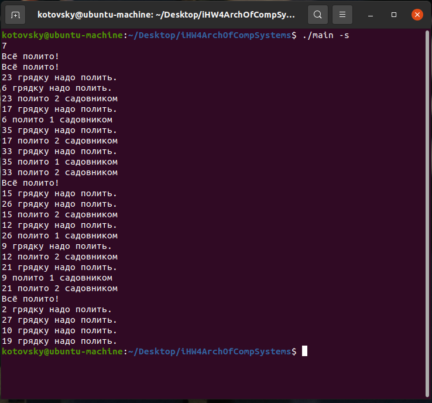
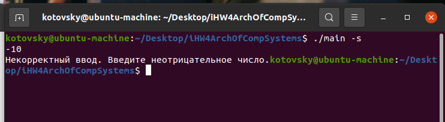
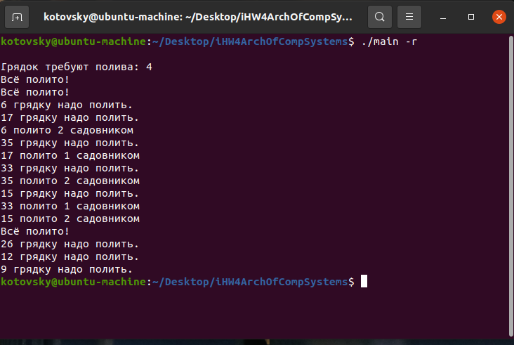

## Архитектура вычислительных систем
### Индивидуальное домашнее задание №4
##### Вариант 15

##### Котовский Семен Олегович, БПИ219
10 декабря 2022 г.

<b>Задание</b>: Задача о клумбе

На клумбе растет 40 цветов, за ними непрерывно следят
два садовника и поливают увядшие цветы, при этом оба садовника очень 
боятся полить один и тот же цветок, который еще не начал вянуть. Создать
многопоточное приложение, моделирующее состояния цветков на клумбе и 
действия садовников. Для изменения состояния цветов создать
отдельный поток (а не 40 потоков для каждого цветка), который может
задавать одновременное начало увядания для нескольких цветков.

## Отчёт о выполнении

### Примечание для тестирования:

Для компиляции программы нужно ввести команду:
<code>g++ main.cpp -o main -lpthread</code>

Для запуска скомпилированного файла необходимо ввести один из ключей: 

<li>запуск с генериацией рандомных значений:<code>./a.out -r output.txt</code>  - результат будет записан в файл output.txt и напечатан в консоль
<li>запуск с вводом из файла (например input.txt):<code>./a.out -f input.txt output.txt</code>  - результат будет записан в файл output.txt
<li>запуск с вводом из консоли: <code>./a.out -s</code>

В качестве ввода должно поступать значение количество не политых грядок по умолчанию.

### Описание сценария программы.

Используем 3 потока. Первый поток занимается генерацией грядок, которые нужно полить. 
Параллельно с первым потоком два других потока, символизирующих садовников, проверяют грядки на необходимость полива.   В случае необходимости - один 
садовник поливает одну грядку. Для выполнения данного условия применяются мьютексы. Мьютексные семафоры (мьютексы) являются упрощённой реализацией семафоров, аналогичной двоичным семафорам с тем отличием, что мьютексы должны отпускаться тем же процессом или потоком, который осуществляет их захват, однако в зависимости от типа и реализации попытка освобождения другим потоком может как освободить мьютекс, так и вернуть ошибку.
  
Отработка программы на нормальном вводе. Вводятся 1 число - кол-во событий генерации не политой грядки. Выводится результат в виде комментирования действий всех трех потоков.

#### 8	баллов
Задача решена на 8 баллов,  все изменения на предыдущие оценки учтены.
<li>	Приведено решение задачи на C++ в файле main.cpp</li>

Пример работы с вводом из консоли: 

Ввод некорректных данных: 

Все случаи некорректного ввода успешно "отлавливаются программой"

• В программу добавлен функционал для генерации случайных наборов данных.

Для корректной работы программы, запускать её необходимо с указанием одного из ключей (-r, -f, -s)

Генерация случайного числа:

### Файлы с тестовыми прогонами:

[in1](tests/in1.txt) 
[in2](tests/in2.txt) 
[in3](tests/in3.txt) 
[out1](tests/out1.txt) 
[out2](tests/out1.txt) 
[out3](tests/out1.txt) 

### Итого получили:

<li>Ввод из консоли, аналогичный предыдущей программе
<li>Комментарии
<li>Алгоритм аналогичный
<li>Работа разных потоков анлогчина
<li>Реализован ввод из консоли
<li>Реализована работа с файлами

 

### Источники литературы

<li>https://habr.com/ru/company/intel/blog/80342/ - Знакомство с уровнями распараллеливания
  
<li>https://habr.com/ru/post/182610/ - Потоки, блокировки и условные переменные в C++11
  
<li>https://radioprog.ru/post/1403 - Многопоточность в C++. Управление потоками